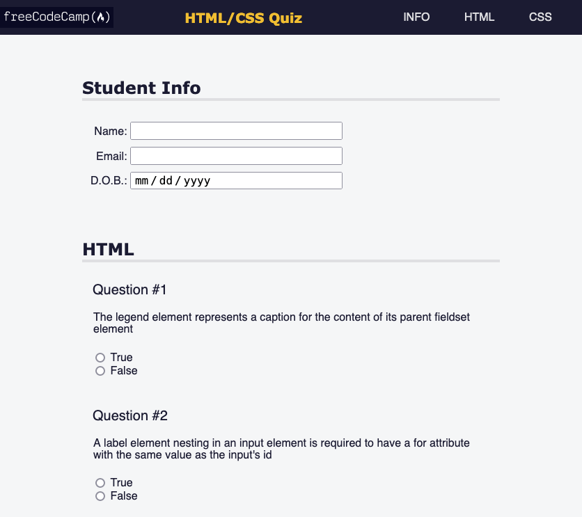
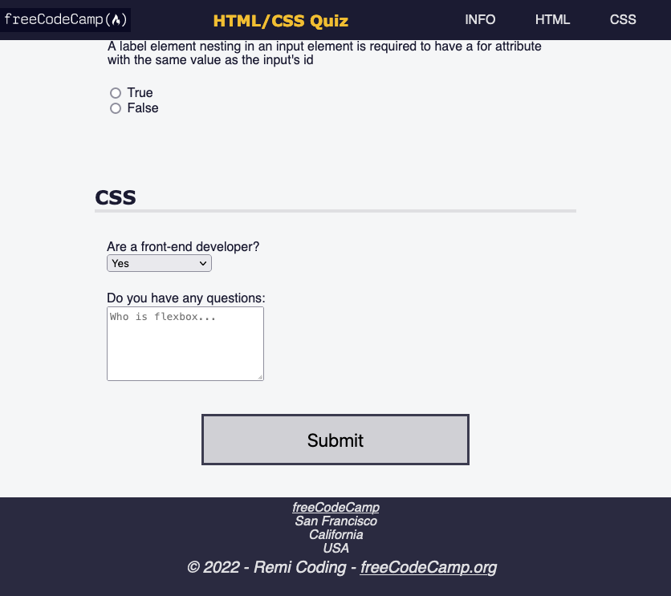

# Quiz Page

This repository contains the HTML and CSS for the **Learn Accessibility by building a Quiz** course by [freeCodeCamp](https://www.freecodecamp.org/learn/2022/responsive-web-design/).

Accessibility is making your webpage easy for all people to use – even people with disabilities.

The `index.html` file contains HTML tags and appropriate classes to use for the manipulation of the elements on the page.

The `css/styles.css` file is use in accord with best accesibility practices and tools such as keyboard shortcuts, ARIA attributes, and design to build a quiz webpage.

The page can be viewed here: [Quiz](https://remicoding.github.io/quiz-page/)

For your convenience, here are screenshots of the page:

